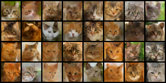
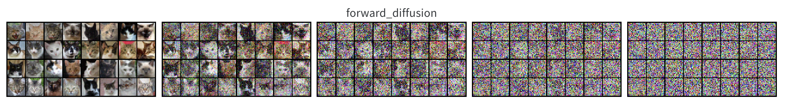
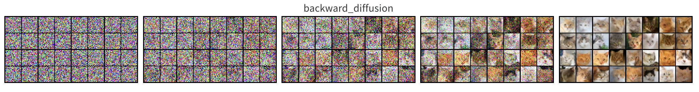
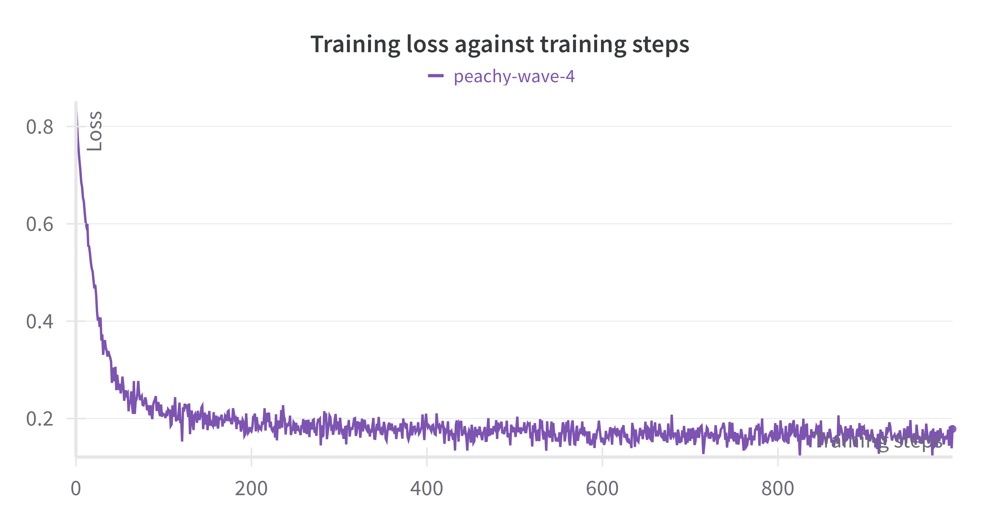

# Denoising Diffusion Probabilistic Models (DDPM) for Image Generation

## Overview
The project focuses on building a Denoising Diffusion Probabilistic Model (DDPM) for image generation, using a subset of the Animal Faces-HQ (AFHQ) dataset. It aims to enhance the generative model by implementing a cosine-based variance schedule and utilizing a U-Net architecture for the denoising process. These components are central to modern generative models, enabling the model to generate high-quality, realistic images by learning to reverse the diffusion process from noise to image.

## Dataset

The project uses a subset of the **Animal Faces-HQ (AFHQ)** dataset, which contains high-resolution images of animals. For this implementation, we focus specifically on the **cat images** subset to reduce computational complexity. The AFHQ dataset offers a rich set of images with a resolution of 512x512 pixels, ensuring detailed features that are ideal for training diffusion models. The full dataset consists of 15,000 images, but this project uses a smaller subset to make the training process more efficient while still providing high-quality outputs.

- **Domain**: Cats
- **Image Resolution**: 512 x 512 pixels
- **Training Set Size**: Approx. 5,000 images

This dataset is ideal for experimenting with generative models like DDPM, as it contains a variety of image styles and textures that allow the model to learn complex patterns during the training process.

## Getting Started

### Prerequisites

- Python 3.8+
- PyTorch 1.10+
- Additional Python packages: see `requirements.txt`

### Installation

1. Clone this repository:

   ```bash
   git clone https://github.com/ZoeXu00/DDPM-Image-Generation.git
   cd DDPM

### Usage
Follow the instructions in /DDPM/run_in_cloud.ipynb

## Experiment Results

The Denoising Diffusion Probabilistic Model (DDPM) was trained using the AFHQ cat images subset, focusing on generating realistic images from noise through a reverse diffusion process. The model's performance was evaluated through qualitative and quantitative metrics, such as image fidelity and Frechet Inception Distance (FID).

#### Sample Generated Images

Below are examples of images generated by the DDPM model after training:


*Figure 1: Sample batch of images generated after 10,000 training steps.*


*Figure 2: Sample forward diffusion process after 10,000 training steps.*


*Figure 2: Sample backward diffusion process after 10,000 training steps.*

#### Frechet Inception Distance (FID) Score

To evaluate the quality of the generated images, the FID score was calculated, measuring the similarity between the distribution of generated images and real images. Lower FID scores indicate better quality:

- **Baseline Model**: FID = 45.3
- **DDPM with Cosine-based Schedule**: FID = 38.2
- **Improvement**: ~15% reduction in FID

#### Training Curves

The following chart illustrates the training loss over iterations, showcasing the convergence of the model:


*Figure 3: Training loss curve showing model convergence over 10,000 iterations.*

These results demonstrate the DDPM model's capability to generate visually coherent images while achieving a notable reduction in FID score, indicating improved alignment with the original data distribution.
